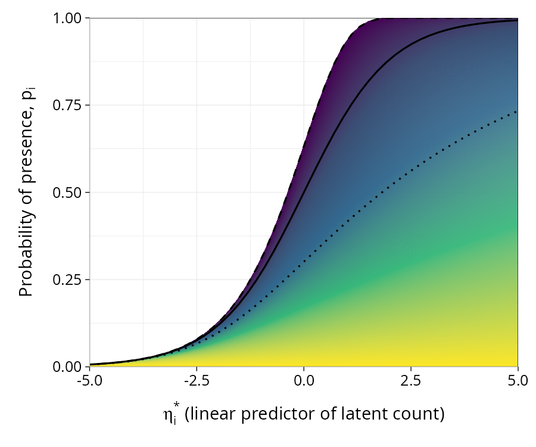

# gcloglog

Package that facilitates fitting a generalized complementary log-log model. Software is appendix to van der Veen and Hui (2026) in prep.

The link is indexed by a dispersion parameter phi, which arises from a latent negative-binomial count. It defines a family of link functions that encompasses the logit (phi = 1) and cloglog (phi = 0) links jointly as special cases, with other values of phi giving further shapes.

<p align="center"></p>

*Probability of presence against the linear predictor of the latent count, for phi from exp(-10) to exp(10), coloured from dark (small phi, little overdispersion in the latent count) to light (large phi). Black lines: logit (solid, phi = 1), cloglog (dashed, phi -> 0), and gcloglog with phi = 5 (dotted).*

## Installation

```r
# install.packages("remotes")
remotes::install_github("BertvanderVeen/gcloglog")
```

## Usage

### A link function at fixed phi

`make.gcloglog(phi)` returns a `"link-glm"` object that can be passed to `binomial()`, and so to `glm()`, `glmer()`, or any other function accepting a family:

```r
library(gcloglog)

set.seed(1)
n <- 500
x <- rnorm(n)
y <- rbinom(n, 1, plogis(0.1 + 2.3 * x))
data <- data.frame(y = y, x = x)

# phi = 1 reproduces logistic regression
model <- glm(y ~ x, family = binomial(link = make.gcloglog(1)), data = data)
coef(model)
```

### Estimating the shape of the link

`profile.gcloglog()` estimates phi by profile likelihood, returns a confidence interval, and refits the model at the estimate:

```r
res <- profile.gcloglog(model)

res$phi.mle          # 0.458
res$CI               # 0.000 1.560, includes 1, so logit is not rejected
coef(res$final.model)
```

By default a plot of the profile likelihood is drawn, with the logit (phi = 1) and cloglog (phi = 0) special cases marked. Use `plot = FALSE` to suppress it, and `CI = FALSE` to skip the (more expensive) profiling step.

If only the point estimate is needed, `profile.phi()` optimises log(phi) directly for a fitted model:

```r
res <- profile.phi(model, y = data$y)
exp(res$optr$par)
```

Methods are available for `glm` (analytical gradient), `merMod` (gradient-free, via `nloptr::bobyqa`), and a default method for any model class implementing `update()` and `logLik()`.

### Standard errors

Standard errors of a model fitted at a fixed phi treat phi as known, and so are too small if phi is estimated. The package  therefore overloads `vcov()`, `summary()`, and `confint()` methods to add a correction to standard errors for the estimation of phi:

```r
fm <- res$final.model
summary(fm)                  # standard errors account for the estimate of phi
vcov(fm)                     # corrected covariance of the coefficients
vcov(fm, correct = FALSE)    # the usual covariance, conditional on phi
confint(fm)                  # Wald intervals from the corrected covariance
```

In this example, the standard error of the slope is 0.44 once the estimation of phi is accounted for, against 0.19 when phi is treated as known.

The asymptotic covariance due to the joint information is a rank-one update of the asynptotic covariance returned by `glm()`. For a `glmer` fit, the joint hessian structure is the same, but the second derivatives involving the shape parameter are more involved, so for now  a finite differences approximation is used to make the correction. `confint(fm, method = "profile")` gives the default profile intervals from `lme4`, which are of course conditional on phi.

When the estimate of phi is at the boundary (phi = 0), the fit is equivalent to cloglog regression and the correction is not defined. The returned standard errors are then those conditional on phi, with a warning from `vcov()` and `confint()` and a note in the printed `summary()`.

## References

Aranda-Ordaz, F. J. (1981). On two families of transformations to additivity for binary response data. *Biometrika*, 68(2), 357-363. doi:10.1093/biomet/68.2.357

van der Veen, B. and Hui, F. K. C. (2026). In prep.
